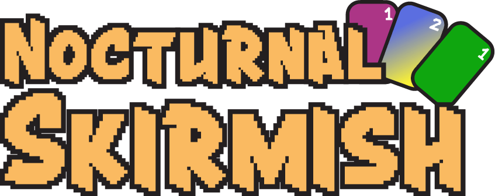

# Nocturnal Skirmish
### ***We could never accomplished this "feet" without our manly makers BimBomSlimSlom, Magic the cow and HengeBenge also known as Lord Beng of Bengladesh.***

Untitled-Game-Terminal-Project also known as Nocturnal Skirmish is not only jut a game but a game hub too.

In this multipul A game you will face your worst fears and experiance action like you've never seen before. take your cards to battle in this emersive open world, 3D, mmo rpg, billion dollar game with not one A, not two A's, not three but four A's. 

## ***Play Untitled-Game-Terminal-Project also known as Nocturnal Skirmish now for 20 American dollars a month this december.***



#### **!here are a few sneak peaks of some of the cards!**

    


### **If you want free acsess to the game before everybody else see down below**

````
Instructions:
-----------------

 Step 1)

 1. call my number: my number(918 55 705)

 2. ask to get free acsess before others

 3. i say no

 Step 2)

 1. call my number: mynumber(967 49 281)

 2. ask to get free acsess before others

 3. i say no

 Step 3)

 1. call my number: mynumber(930 12 997)

 2. ask to get free acsess before others

 3. i say no

 step 4)

 1. find us at Kuben VGS

 2. ask us at the same time if you can get free acsess before others.

 3. we say sure

 4. give us 20 American Dollars

 5. you have free acsess before others ;=}
````
# Technical overview
Introduction:
GameHub/Nocturnal Skirmish is a website written in PHP, JavaScript, CSS and HTML. jQuery is used extensivly throughout the website for AJAX requests.
The website is semi single page, and many modals are used to prevent refreshes, and the modals are separete files that are loaded in through AJAX GET requests.
Both PHP and JavaScript libraries and imports are used in the website.
PHP libraries include:
 - <a href='https://www.phpmyadmin.net/'>phpMyAdmin</a>
 - <a href='https://github.com/PHPMailer/PHPMailer'>PHPMailer</a>
JavaScript libraries and imports include:
 - <a href='https://jquery.com/'>jQuery</a>
 - <a href='https://fengyuanchen.github.io/cropperjs/'>CropperJS</a>
 - <a href='https://lcweb.it/lc-emoji-picker-javascript-plugin/'>LC Emoji Picker</a>
 
                                                              
 
