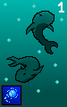

# Nocturnal Skirmish
### ***We could never accomplished this "feet" without our manly makers BimBomSlimSlom, Magic the cow and HengeBenge also known as Lord Beng of Bengladesh.***

Untitled-Game-Terminal-Project also known as Nocturnal Skirmish is not only jut a game but a game hub too.

In this multipul A game you will face your worst fears and experiance action like you've never seen before. take your cards to battle in this emersive open world, 3D, mmo rpg, billion dollar game with not one A, not two A's, not three but four A's. 

## ***Play Untitled-Game-Terminal-Project also known as Nocturnal Skirmish now for 20 American dollars a month this december.***


#### **!here are a few sneak peaks of some of the cards!**

    


### **If you want free acsess to the game before everybody else see down below**

````
Instructions:
-----------------

 Step 1)

 1. call my number: my number(918 55 705)

 2. ask to get free acsess before others

 3. i say no

 Step 2)

 1. call my number: mynumber(967 49 281)

 2. ask to get free acsess before others

 3. i say no

 Step 3)

 1. call my number: mynumber(930 12 997)

 2. ask to get free acsess before others

 3. i say no

 step 4)

 1. find us at Kuben VGS

 2. ask us at the same time if you can get free acsess before others.

 3. we say sure

 4. give us 20 American Dollars

 5. you have free acsess before others ;=}
````

# Technical overview
## Introduction: <br>
GameHub/Nocturnal Skirmish is a website written in PHP, JavaScript, CSS and HTML. jQuery is used extensivly throughout the website for AJAX requests.
The website is semi single page, and many modals are used to prevent refreshes, and the modals are seperate files that are loaded in through AJAX GET requests.
The website is hosted on <a href="https://www.iis.net/">Microsoft Internet Information Services Version 10.0.22621.1</a> on a Windows 11 machine and uses the <a href="https://dev.mysql.com/downloads/mysql/">MySQL Community Server</a> as the database. The PHP version used is version 8.4, and the FastCGI version is used (php-cgi.exe).
Both PHP and JavaScript libraries and imports are used in the website. <br>

PHP libraries include: <br>
 - <a href='https://www.phpmyadmin.net/'>phpMyAdmin</a>
 - <a href='https://github.com/PHPMailer/PHPMailer'>PHPMailer</a>
 
JavaScript libraries and imports include:
 - <a href='https://jquery.com/'>jQuery</a>
 - <a href='https://fengyuanchen.github.io/cropperjs/'>CropperJS</a>
 - <a href='https://lcweb.it/lc-emoji-picker-javascript-plugin/'>LC Emoji Picker</a>
 ## Setup:
 To download and host the server you need to first enable Internet Information Services on your Windows machine, along with the FastCGI module.
 Then you need to download PHP 8.4 to C:\php.
 In php.ini, make sure to enable the mysqli extension.
 Then you need to download the MySQL Community Server.
 Then you need to copy the contents in the <b>website</b> folder into C:\inetpub\wwwroot. 
 Make sure the IIS_IUSRS account has access to all files in the directory. 
 Then you need to download phpMyAdmin, and place phpMyAdmin in the phpMyAdmin folder. 

 In IIS, you need to create a new FastCGI module mapping, and set the request path to *.php, the module to FastCgiModule, the executable to C:\php\php-cgi.exe and the name to php.
 Then you need to set a MIME type for webp files, as they are used alot in the website.
 Then you need to set the default document to index.php

 Then you need to make a folder in wwwroot called <b>config</b>
 This folder needs to include these files that you have to make yourself:
 - admin_hash.php
 - conn.php
 - devcode_special.php
 - mail_cred.php
<br>

These files include sensitive information, which is why they are not included in the repo.
You need to replace the credentials in the files below with your own: <br>

<b>admin_hash.php:</b> This file includes a hash for the password for logging in to the Admin Center. <br>
~~~
 <?php
//Hash for admin password
// Is in gitignore

$admin_hash = 'your_hash_here';
~~~

<b>conn.php:</b> This file includes credentials for connecting to MySQL database.<br>
~~~
<?php
// Is in gitignore

$servername = "localhost";
$username = "root";
$password = "your_password_here";

// Create connection
$conn = new mysqli($servername, $username, $password);

// Check connection
if ($conn->connect_error) {
    die("Connection failed: " . $conn->connect_error);
}

$conn -> select_db("gamehub");
~~~

<b>devcode_special.php:</b> This file includes devcodes that do more than one action, or do more than update a column in SQL. These codes specifically give the user all the borders, and removes all redeemed codes. <br>
~~~
<?php
// Checks if devcode is a special code that does other things than usual

require "../php_scripts/avoid_errors.php";

if ($posted_devcode == "code_that_gives_all_borders") {
    // For each border in borders directory, add it to user inventory
    $borders = array_diff(scandir(dirname(dirname(__FILE__)) . "/img/borders"), array('..', '.'));
    foreach($borders as $file) {
        $sql1 = "INSERT INTO border_inventory (user_id, border) VALUES ('" . $_SESSION['user_id'] . "', '$file')";
        $conn->query($sql1);
    };
} else if ($posted_devcode == "code_that_resets_redeemed_codes") {
    //Resets redeemed codes for user who is logged in.
    $sql1 = "DELETE FROM redeemed_codes WHERE user_id = " . $_SESSION['user_id'];
    $conn->query($sql1);
    exit;
}
~~~

<b>mail_cred.php:</b> This file includes credentials for sending email with PHPMailer. <br>
~~~
<?php
//Credentials for email sending
// Is in gitignore

$mailpassword = "your_email_password";
$mailusername = "your_email_username";
?>
~~~

Next thing to do is create the necessary databases and tables inside the MySQL server. Copy the code from sql/create_database.sql into the SQL tab on phpMyAdmin and execute it.
                                                              
 
