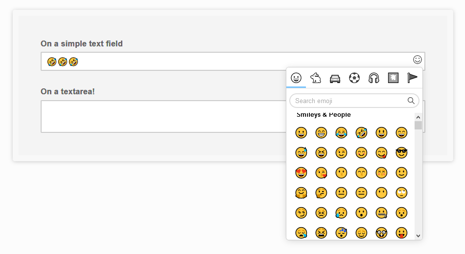

# Pure javascript emoji picker by LCweb

No dependencies **vanilla javascript plugin** attaching a full-featured emoji picker to text inputs and textareas!

Features emoji search and categorization, in just 15KB! (+ emoji list JSON file)




For live demos check: https://lcweb.it/lc-emoji-picker-javascript-plugin


## Installation & Usage

1. include lc_emoji_picker.min.js

2. initialize plugin targeting one/multiple fields

3. by default it will fetch emoji-list.min.js from the Github repository, it's recommended to upload it on your server and set *emoji_json_url* option

```
<script type="text/javascript>
new lc_emoji_picker('textarea, input');
</script>
```

## Options

Here are listed available options with default values


```
<script type="text/javascript>
new lc_emoji_picker('textarea, input', {

    // (string) html code injected as picker trigger  
    picker_trigger : 
    '<svg version="1.1" xmlns="http://www.w3.org/2000/svg" xmlns:xlink="http://www.w3.org/1999/xlink" x="0px" y="0px" viewBox="0 0 512 512" xml:space="preserve"><g><g><path d="M437.02,74.98C388.667,26.629,324.38,0,256,0S123.333,26.629,74.98,74.98C26.629,123.333,0,187.62,0,256s26.629,132.668,74.98,181.02C123.333,485.371,187.62,512,256,512s132.667-26.629,181.02-74.98C485.371,388.668,512,324.38,512,256S485.371,123.333,437.02,74.98z M256,472c-119.103,0-216-96.897-216-216S136.897,40,256,40s216,96.897,216,216S375.103,472,256,472z"/></g></g><g><g><path d="M368.993,285.776c-0.072,0.214-7.298,21.626-25.02,42.393C321.419,354.599,292.628,368,258.4,368c-34.475,0-64.195-13.561-88.333-40.303c-18.92-20.962-27.272-42.54-27.33-42.691l-37.475,13.99c0.42,1.122,10.533,27.792,34.013,54.273C171.022,389.074,212.215,408,258.4,408c46.412,0,86.904-19.076,117.099-55.166c22.318-26.675,31.165-53.55,31.531-54.681L368.993,285.776z"/></g></g><g><g><circle cx="168" cy="180.12" r="32"/></g></g><g><g><circle cx="344" cy="180.12" r="32"/></g></g><g></g><g></g><g></g><g></g><g></g><g></g><g></g><g></g><g></g><g></g><g></g><g></g><g></g><g></g><g></g></svg>', 

    // (object) defies trigger position relatively to target field
    trigger_position    : {
        top : '5px',
        right: '5px',
    },
    
    // (object) defines trigger size
    trigger_size : { 
            height : '22px',
            width: '22px',
        },
    
    // (int) right padding value (in pixels) applied to target field to avoid texts under the trigger
    target_r_padding    : 27, 
    
    // (string) emoji JSON url
    emoji_json_url      : 'https://raw.githubusercontent.com/LCweb-ita/LC-emoji-picker/master/emoji-list.min.json',
    
    // (array) option used to translate script texts
    labels : [ 
        'insert emoji',
        'search emoji',
        '.. no results ..',
    ],
    
    // (function) triggered as soon as an emoji is selected. Passes emoji and target field objects as parameters
    selection_callback  : null, // function(emoji, target_field) {},
});
</script>
```


* * *


Copyright &copy; Luca Montanari - [LCweb](https://lcweb.it)
